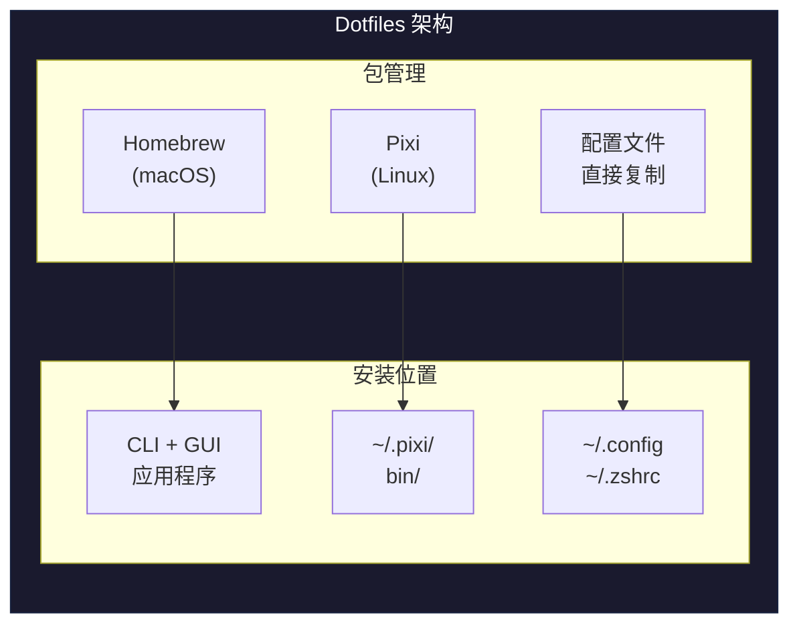

# Dotfiles

个人开发环境配置。

## ✨ 特性

- 🚀 **原生体验** - 无需 wrapper、chroot 或额外的环境激活
- 🔒 **完全 Rootless** - Linux 上所有内容安装在用户目录，无需 root 权限
- 🏗️ **跨平台** - 支持 Linux (x86_64, aarch64) 和 macOS (x86_64, arm64)
- ⚡ **快速** - 所有工具预编译，秒装即用
- 📦 **构建工具** - 包含 GCC/Make/CMake，无需系统级安装
- 🎨 **智能补全** - zsh-autocomplete 自动补全 + 彩色分组显示
- 📝 **历史记录** - 带时间戳的命令历史，容量无限
- 🧹 **整洁 Home** - 缓存文件统一存放在 `~/.cache/zsh/`

## 🏛️ 架构

| 平台 | 包管理 | 配置管理 |
|------|--------|----------|
| **macOS** | Homebrew | 直接复制 |
| **Linux** | Pixi (conda-forge) | 直接复制 |



> 💡 完全用户级，无需 root，全部预编译

## 📦 包含的工具

### 编程语言 (Pixi)

| 语言 | 说明 |
|------|------|
| Python | 通用脚本语言 |
| Node.js | JavaScript 运行时 |
| Go | 系统编程 |
| Rust | 安全的系统编程 |
| Ruby | 脚本和 Web 开发 |
| Lua | 嵌入式脚本 |
| Java (OpenJDK) | 企业级开发 |

### CLI 工具 (Pixi)

| 工具 | 说明 |
|------|------|
| fzf | 模糊搜索 |
| ripgrep (rg) | 快速代码搜索 |
| fd | 现代化 find |
| bat | 带语法高亮的 cat |
| eza | 现代化 ls |
| dust | 现代化 du |
| tree | 目录树显示 |
| neovim | 编辑器 |
| jq / yq | JSON/YAML 处理 |
| tldr | 简洁的命令手册 |
| fastfetch | 系统信息 |

### 构建工具 (Pixi) - 完全 Rootless

| 工具 | 说明 |
|------|------|
| gcc / g++ | C/C++ 编译器 |
| make | 构建工具 |
| cmake | 跨平台构建系统 |
| ninja | 快速构建系统 |
| pkg-config | 库配置工具 |
| openssl / zlib | 开发库 |

### Zsh 插件 (Zinit)

| 插件 | 说明 |
|------|------|
| powerlevel10k | 快速美观的主题 |
| zsh-autocomplete | 实时自动补全菜单 |
| zsh-autosuggestions | 历史命令建议 |
| fast-syntax-highlighting | 语法高亮 |
| zsh-completions | 额外补全定义 |
| Oh My Zsh 片段 | git、clipboard、directories、history 等 |

### Zsh 功能增强

| 功能 | 说明 |
|------|------|
| 彩色补全列表 | 文件类型、目录、命令等使用不同颜色 |
| 分组标题高亮 | 补全分组使用彩色加粗标题 |
| 历史时间戳 | 每条命令记录执行时间 |
| 缓存整理 | `.zcompdump`、`.zsh_history` 存放在 `~/.cache/zsh/` |
| 目录优先 | 补全列表中目录排在文件前面 |

### VSCode/Cursor 插件

自动检测编辑器类型，安装对应插件：

- 通用插件：Rust、Go、Python、C/C++、Markdown 等
- VSCode 专属：ms-vscode.cpptools、remote-ssh 等
- Cursor 专属：anysphere.cpptools、anysphere.remote-ssh 等

## 🚀 快速开始

### 一键安装

```bash
curl -fsSL https://raw.githubusercontent.com/Learner-Geek-Perfectionist/Dotfiles/beta/install.sh | bash
```

### 安装选项

```bash
# 完整安装
./install.sh

# 仅安装 Pixi（包管理）
./install.sh --pixi-only

# 跳过 VSCode 插件
./install.sh --skip-vscode

# 跳过 Dotfiles 配置
./install.sh --skip-dotfiles
```

### 卸载

```bash
# 仅删除 Pixi 及其安装的工具
./uninstall.sh --pixi

# 仅删除已部署的 Dotfiles
./uninstall.sh --dotfiles

# 交互式选择（默认）
./uninstall.sh
```

## 📁 目录结构

```text
Dotfiles/
├── install.sh                    # 主安装脚本
├── uninstall.sh                  # 卸载脚本
├── .zshrc                        # Zsh 主配置（PATH、别名、setopt）
├── .zprofile                     # Zsh 登录配置
├── .zshenv                       # Zsh 环境变量（最先加载，缓存路径、历史配置）
├── .config/
│   ├── zsh/                      # Zsh 插件和工具
│   │   ├── plugins/
│   │   │   ├── zinit.zsh         # Zinit 插件管理 + 补全配置
│   │   │   └── platform.zsh      # 平台特定配置
│   │   ├── fzf/                  # fzf 配置
│   │   └── .p10k.zsh             # Powerlevel10k 主题配置
│   ├── kitty/                    # Kitty 终端配置
│   ├── Code/User/                # VSCode 设置
│   └── Cursor/User/              # Cursor 设置
├── .pixi/manifests/
│   └── pixi-global.toml          # Pixi 全局工具定义
├── scripts/
│   ├── install_pixi.sh           # Pixi 安装脚本
│   ├── install_dotfiles.sh       # Dotfiles 部署脚本
│   ├── install_vscode_ext.sh     # VSCode/Cursor 插件安装
│   └── macos_install.sh          # macOS Homebrew 安装
├── lib/
│   ├── packages.sh               # Homebrew 包定义
│   └── utils.sh                  # 工具函数
└── docs/
    └── flowchart.md              # 架构流程图
```

## 🔧 常用命令

### Pixi (包管理)

```bash
pixi global list              # 列出已安装的工具
pixi global install <pkg>     # 安装工具
pixi global upgrade           # 升级所有工具
pixi global remove <pkg>      # 移除工具
pixi global sync              # 同步 pixi-global.toml 配置
```

### Homebrew (macOS)

```bash
brew update           # 更新索引
brew upgrade          # 升级所有包
brew cleanup          # 清理缓存
```

### Zsh 配置

```bash
reload                # 重新加载配置 (alias)
upgrade               # 更新 Dotfiles 配置
uninstall             # 卸载 Dotfiles
```

### 常用别名

| 别名 | 原命令 | 说明 |
|------|--------|------|
| `cat` | `bat` | 带语法高亮的 cat |
| `man` | `tldr` | 简洁的命令手册 |
| `ls` | `eza --icons` | 带图标的现代化 ls |
| `g1` | `git clone --depth=1` | 浅克隆 |
| `cp` | `cp -r` | 递归复制 |
| `mkdir` | `mkdir -p` | 递归创建目录 |
| `show` | `kitty +kitten icat` | 终端显示图片 |

## ⚙️ 自定义

### 添加新工具 (Pixi)

编辑 `~/.pixi/manifests/pixi-global.toml`：

```toml
[envs.deno]
channels = ["conda-forge"]
[envs.deno.dependencies]
deno = "*"
[envs.deno.exposed]
deno = "deno"
```

然后运行 `pixi global sync`。

### 本地配置（不受版本控制）

创建 `~/.zshrc.local`：

```bash
export MY_SECRET_TOKEN="xxx"
alias myalias='...'
```

## 📋 系统要求

- **操作系统**: Linux (x86_64, aarch64) 或 macOS (x86_64, arm64)
- **Shell**: Bash 4+ 或 Zsh
- **依赖**: git, curl

## 🗂️ 安装位置

| 平台 | 工具安装位置 | 配置位置 |
|------|-------------|---------|
| Linux | `~/.pixi/bin/` | `~/.config/` |
| macOS | `/opt/homebrew/` | `~/.config/` |

### 缓存文件位置

| 文件 | 位置 | 说明 |
|------|------|------|
| `.zcompdump` | `~/.cache/zsh/.zcompdump` | 补全缓存（非 home 目录） |
| `.zsh_history` | `~/.cache/zsh/.zsh_history` | 命令历史 |
| Zinit 插件 | `~/.local/share/zinit/` | 插件安装位置 |
| p10k 缓存 | `~/.cache/p10k-instant-prompt-*.zsh` | 主题快速启动缓存 |

## 📄 许可证

MIT License
