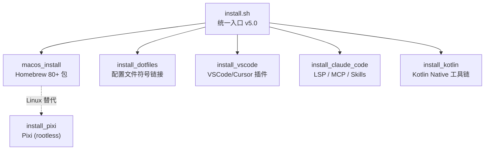
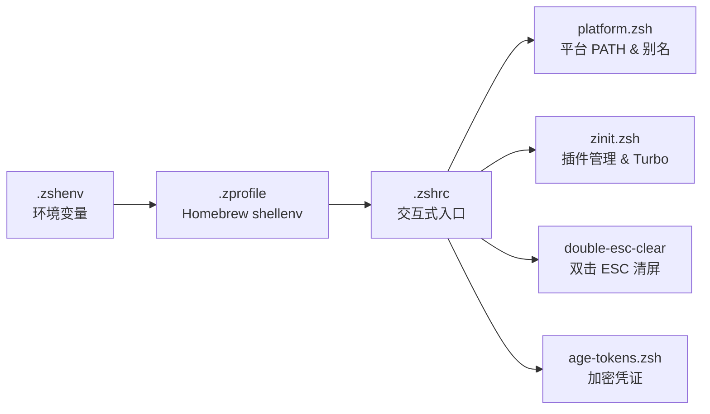
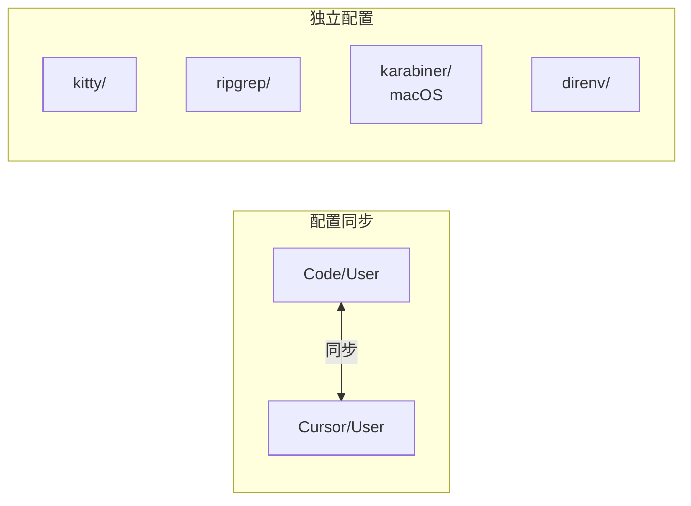

# Dotfiles

跨平台（macOS / Linux）开发环境一键部署系统。一条命令完成 Shell、编辑器、终端、Git、SSH、包管理、AI 工具链的全套配置。

---

## 快速开始

```bash
# 完整安装（macOS: Homebrew + 配置 / Linux: Pixi + 配置）
curl -fsSL https://raw.githubusercontent.com/Learner-Geek-Perfectionist/Dotfiles/beta/install.sh | bash

# 浅克隆到本地（仅最新提交，节省带宽）
git clone --depth=1 -b beta https://github.com/Learner-Geek-Perfectionist/Dotfiles.git

# 选择性安装
bash install.sh --dotfiles-only   # 仅配置文件
bash install.sh --pixi-only       # 仅 Pixi 包管理器（Linux）
bash install.sh --vscode-only     # 仅 VSCode/Cursor 插件
bash install.sh --lsp-only        # 仅 LSP 服务器
bash install.sh --skip-vscode     # 跳过 VSCode 插件
```

## 功能概览

### Shell（Zsh）

- **[Zinit](https://github.com/zdharma-continuum/zinit)** 插件管理器，Turbo 异步加载
- **[Powerlevel10k](https://github.com/romkatv/powerlevel10k)** 主题，instant prompt 缓存加速
- **[fzf-tab](https://github.com/Aloxaf/fzf-tab)** 模糊补全、**[fast-syntax-highlighting](https://github.com/zdharma-continuum/fast-syntax-highlighting)** 语法高亮、**[zsh-autosuggestions](https://github.com/zsh-users/zsh-autosuggestions)** 自动建议
- 智能命令包装：`fd` 自动提权、`cat` → `bat`、`ls` → `eza`、`man` → `tldr`
- `.zwc` 字节码预编译加速启动
- **[age](https://github.com/FiloSottile/age)** 加密令牌管理

### 包管理

| 平台 | 管理器 | 配置文件 |
|------|--------|----------|
| macOS | Homebrew | `lib/packages.sh`（80+ formulas & casks） |
| Linux | Pixi（无需 root，conda-forge） | `pixi.toml`（90+ 包） |

### 终端 & 编辑器

- **[Kitty](https://sw.kovidgoyal.net/kitty/)** 终端，Catppuccin Frappe 主题，智能标签页/关闭脚本
- **VSCode / Cursor** 配置同步（settings.json + keybindings.json），插件自动安装
- **Neovim / Vim**

### macOS 专属

- **[Karabiner-Elements](https://karabiner-elements.pqrs.org/)** 键盘改键
- **[Hammerspoon](https://www.hammerspoon.org/)** 窗口管理与自动化
- Homebrew 自动更新（`brew autoupdate`）

### AI 工具链

- **Claude Code** CLI + LSP 服务器（pyright, gopls, rust-analyzer, clangd, kotlin-ls 等）
- MCP 服务器集成、插件市场、Skill 系统

### 开发工具链

语言：Python, Node.js, Go, Rust, Kotlin, Java, Ruby, Lua, C/C++（LLVM/GCC）

构建：CMake, Ninja, Make, Autoconf

## 架构

### 安装模块


```mermaid
graph TD
    A["install.sh<br/>统一入口 v5.0"] --> B["macos_install<br/>Homebrew 80+ 包"]
    A --> C["install_dotfiles<br/>配置文件符号链接"]
    A --> D["install_vscode<br/>VSCode/Cursor 插件"]
    A --> E["install_claude_code<br/>LSP / MCP / Skills"]
    A --> F["install_kotlin<br/>Kotlin Native 工具链"]
    B -. "Linux 替代" .-> G["install_pixi<br/>Pixi (rootless)"]
```

### Shell 加载顺序


```mermaid
graph LR
    A[".zshenv<br/>环境变量"] --> B[".zprofile<br/>Homebrew shellenv"]
    B --> C[".zshrc<br/>交互式入口"]
    C --> D["platform.zsh<br/>平台 PATH & 别名"]
    C --> E["zinit.zsh<br/>插件管理 & Turbo"]
    C --> F["double-esc-clear<br/>双击 ESC 清屏"]
    C --> G["age-tokens.zsh<br/>加密凭证"]
```

### 应用配置（.config/）


```mermaid
graph LR
    subgraph sync ["配置同步"]
        A["Code/User"] <-- "同步" --> B["Cursor/User"]
    end
    subgraph standalone ["独立配置"]
        C["kitty/"]
        D["ripgrep/"]
        E["karabiner/<br/>macOS"]
        F["direnv/"]
    end
```

## 设计原则

- **模块化** — 每个组件独立安装/卸载
- **幂等** — 重复执行安全无副作用
- **对称** — 每个 install 都有对应的 uninstall
- **无需 root** — Linux 全程 rootless（Pixi + conda-forge）
- **管道安全** — 支持 `curl | bash` 远程执行

## 卸载

```bash
bash uninstall.sh --all            # 全部卸载
bash uninstall.sh --dotfiles       # 仅配置文件
bash uninstall.sh --pixi           # 仅 Pixi
bash uninstall.sh --claude         # 仅 Claude Code
```

## 许可证

MIT
