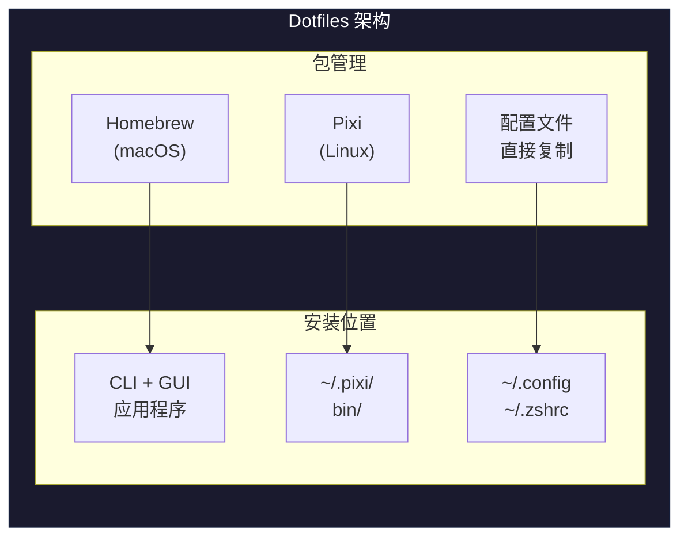

# Dotfiles

个人开发环境配置。

## ✨ 特性

- 🚀 **原生体验** - 无需 wrapper、chroot 或额外的环境激活
- 🔒 **完全 Rootless** - Linux 上所有内容安装在用户目录，无需 root 权限
- 🏗️ **跨平台** - 支持 Linux (x86_64, aarch64) 和 macOS (x86_64, arm64)
- ⚡ **快速** - 所有工具预编译，秒装即用
- 📦 **构建工具** - 包含 GCC/Clang 双工具链，无需系统级安装
- 🎨 **智能补全** - fzf-tab 模糊补全 + 彩色分组显示
- 📝 **历史记录** - 带时间戳的命令历史，容量无限
- 🧹 **整洁 Home** - 缓存文件统一存放在 `~/.cache/zsh/`
- 🔐 **加密凭证** - age 加密的 token 自动解密加载

## 🏛️ 架构

| 平台 | 包管理 | 配置管理 |
|------|--------|----------|
| **macOS** | Homebrew | 直接复制 |
| **Linux** | Pixi (conda-forge) | 直接复制 |


```mermaid
graph TB
    subgraph arch["Dotfiles 架构"]
        direction TB

        subgraph top["包管理"]
            A["Homebrew<br/>(macOS)"]
            B["Pixi<br/>(Linux)"]
            C["配置文件<br/>直接复制"]
        end

        subgraph bottom["安装位置"]
            D["CLI + GUI<br/>应用程序"]
            E["~/.pixi/<br/>bin/"]
            F["~/.config<br/>~/.zshrc"]
        end

        A --> D
        B --> E
        C --> F
    end

    style arch fill:#1a1a2e,stroke:#16213e,color:#fff
```

> 💡 完全用户级，无需 root，全部预编译

## 📦 包含的工具

| 类别 | 包含 |
|------|------|
| 编程语言 | Python、Node.js、Go、Rust、Ruby、Lua、Java、Kotlin |
| CLI 工具 | fzf、ripgrep、fd、bat、eza、gh、tmux、neovim、jq/yq、tldr、direnv 等 |
| 构建工具 | GCC / Clang 双工具链、CMake、Ninja、Make、autoconf 等 |
| 开发库 | OpenSSL、zlib、Boost、readline、ncurses、gtest 等 |
| 代码工具 | ruff、pyright、go-shfmt、doxygen、graphviz |
| 加密 | age（用于 token 加密存储） |

> 完整列表见 [`pixi.toml`](pixi.toml)

### Zsh 插件 (Zinit)

| 插件 | 说明 |
|------|------|
| powerlevel10k | 快速美观的主题 |
| fzf-tab | fzf 驱动的补全菜单 |
| zsh-autosuggestions | 历史命令建议 |
| fast-syntax-highlighting | 语法高亮 |
| zsh-completions | 额外补全定义 |
| Oh My Zsh 片段 | git、clipboard、directories、history、key-bindings、colored-man-pages 等 |
| age-tokens | 加密 token 自动解密加载 |

### Zsh 功能增强

| 功能 | 说明 |
|------|------|
| 彩色补全列表 | 文件类型、目录、命令等使用不同颜色 |
| 分组标题高亮 | 补全分组使用彩色加粗标题 |
| 历史时间戳 | 每条命令记录执行时间 |
| 缓存整理 | `.zcompdump`、`.zsh_history` 存放在 `~/.cache/zsh/` |
| 目录优先 | 补全列表中目录排在文件前面 |

### VSCode/Cursor 插件

自动检测编辑器类型，安装对应插件：

- **语言支持**：Rust、Go、Python、C/C++、Java、Kotlin、Lua、Shell、Markdown
- **工具**：Docker、Git Graph、TOML、Clang Format、AutoCorrect
- **依赖管理**：dependi（Cargo/npm/pip 依赖版本检查）
- **本地化**：中文语言包

> 完整列表见 [`scripts/install_vscode_ext.sh`](scripts/install_vscode_ext.sh)

## 🚀 快速开始

### 一键安装

**最小化系统**（如 Docker 容器）需要先安装 curl：

```bash
# 容器/root 用户
apt update && apt install -y curl git zsh sudo && \
  curl -fsSL https://raw.githubusercontent.com/Learner-Geek-Perfectionist/Dotfiles/beta/install.sh | bash

# 普通用户（需要 sudo）
sudo apt update && sudo apt install -y curl git zsh sudo && \
  curl -fsSL https://raw.githubusercontent.com/Learner-Geek-Perfectionist/Dotfiles/beta/install.sh | bash
```

**已有 curl 的系统**可以直接运行：

```bash
curl -fsSL https://raw.githubusercontent.com/Learner-Geek-Perfectionist/Dotfiles/beta/install.sh | bash
```

### 浅克隆安装（推荐）

```bash
# 浅克隆仓库（只获取最新提交，速度更快）
git clone --depth=1 -b beta https://github.com/Learner-Geek-Perfectionist/Dotfiles.git

# 进入目录并安装
cd Dotfiles && ./install.sh
```

### 安装选项

```bash
# 完整安装
./install.sh

# 仅安装 Pixi（仅限 Linux，跳过 Dotfiles 和 VSCode）
./install.sh --pixi-only

# 仅安装 Dotfiles 配置（跳过包管理和 VSCode）
./install.sh --dotfiles-only

# 仅安装 VSCode/Cursor 插件
./install.sh --vscode-only

# 仅安装 LSP Servers 及工具
./install.sh --lsp-only

# 跳过 VSCode 插件
./install.sh --skip-vscode

# 跳过 Dotfiles 配置
./install.sh --skip-dotfiles
```

### 卸载

```bash
# 仅删除 Pixi 及其安装的工具
./uninstall.sh --pixi

# 仅删除已部署的 Dotfiles
./uninstall.sh --dotfiles

# 同时删除 Pixi 和 Dotfiles
./uninstall.sh --all

# 跳过确认提示
./uninstall.sh --all -f

# 交互式选择（默认）
./uninstall.sh
```

## 📁 目录结构

```text
Dotfiles/
├── install.sh / uninstall.sh       # 安装/卸载入口
├── pixi.toml                       # Pixi 依赖定义
├── .zshrc / .zprofile / .zshenv    # Zsh 配置
├── .envrc                          # direnv Home 环境
├── .gitconfig / .gitignore         # Git 配置
├── .ssh/                           # SSH 配置
├── .claude/                        # Claude Code 配置
├── cursor-ssh-fix.sh               # Cursor SSH 连接修复脚本
├── scripts/                        # 安装子脚本（pixi、dotfiles、vscode、claude code、kotlin native）
├── lib/                            # 工具函数（packages.sh、utils.sh）
├── .config/                        # 应用配置（zsh、kitty、direnv、ripgrep、karabiner）
├── .hammerspoon/                   # macOS 自动化（Lua）
├── Library/Application Support/    # macOS 编辑器配置
├── sh-script/                      # 独立脚本（get-my-ip、envrc 模板）
└── docs/                           # 文档
```

## 🔧 常用命令

### Pixi (包管理)

```bash
pixi global list              # 列出已安装的工具
pixi global install <pkg>     # 安装工具
pixi global upgrade           # 升级所有工具
pixi global remove <pkg>      # 移除工具
pixi global sync              # 同步 pixi-global.toml 配置
```

### Homebrew (macOS)

```bash
brew update           # 更新索引
brew upgrade          # 升级所有包
brew cleanup          # 清理缓存
```

### Zsh 配置

```bash
reload                # 重新加载配置 (alias)
upgrade               # 更新 Dotfiles 配置
uninstall             # 卸载 Dotfiles
```

### 常用别名

| 别名 | 实际命令 | 说明 |
|------|---------|------|
| `cat` | `bat`（含 ANSI fallback） | 语法高亮的 cat |
| `ls` | `eza --icons` | 带图标的现代化 ls |
| `man` | `tldr` | 简洁命令手册 |
| `g1` | `git clone --depth=1 --recursive` | 浅克隆（含子模块） |
| `python` | `python3` | 默认 Python 3 |
| `getip` | `sh-script/get-my-ip.sh` | 获取本机 IP |

## ⚙️ 自定义

### 添加新工具 (Pixi)

编辑 `~/.pixi/manifests/pixi-global.toml`：

```toml
[envs.deno]
channels = ["conda-forge"]
[envs.deno.dependencies]
deno = "*"
[envs.deno.exposed]
deno = "deno"
```

然后运行 `pixi global sync`。

### 本地配置（不受版本控制）

创建 `~/.zshrc.local`：

```bash
export MY_SECRET_TOKEN="xxx"
alias myalias='...'
```

## 📋 系统要求

- **操作系统**: Linux (x86_64, aarch64) 或 macOS (x86_64, arm64)
- **Shell**: Bash 4+ 或 Zsh
- **依赖**: git, curl

## 🗂️ 安装位置

| 平台 | 工具安装位置 | 配置位置 |
|------|-------------|---------|
| Linux | `~/.pixi/bin/` | `~/.config/` |
| macOS | `/opt/homebrew/` | `~/.config/` |

### 缓存文件位置

| 文件 | 位置 | 说明 |
|------|------|------|
| `.zcompdump` | `~/.cache/zsh/.zcompdump` | 补全缓存（非 home 目录） |
| `.zsh_history` | `~/.cache/zsh/.zsh_history` | 命令历史 |
| Zinit 插件 | `~/.local/share/zinit/` | 插件安装位置 |
| p10k 缓存 | `~/.cache/p10k-instant-prompt-*.zsh` | 主题快速启动缓存 |

## 📄 许可证

MIT License
