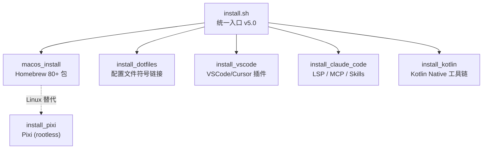
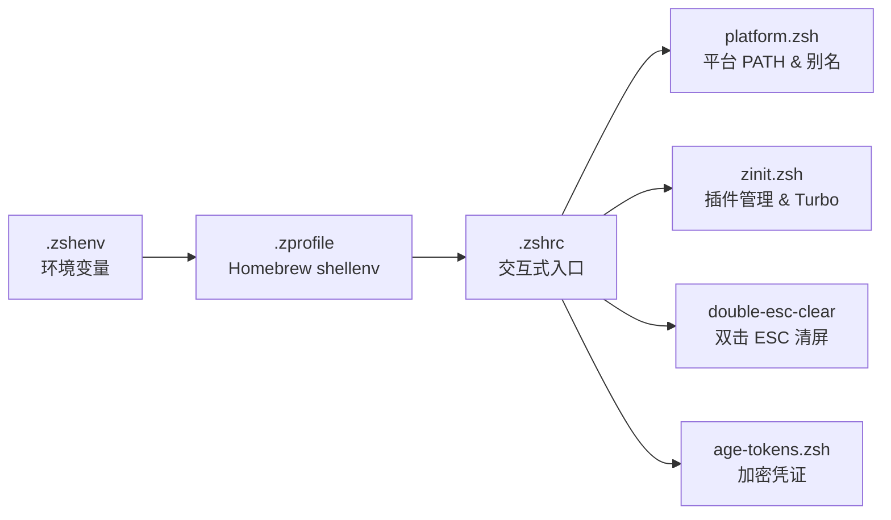
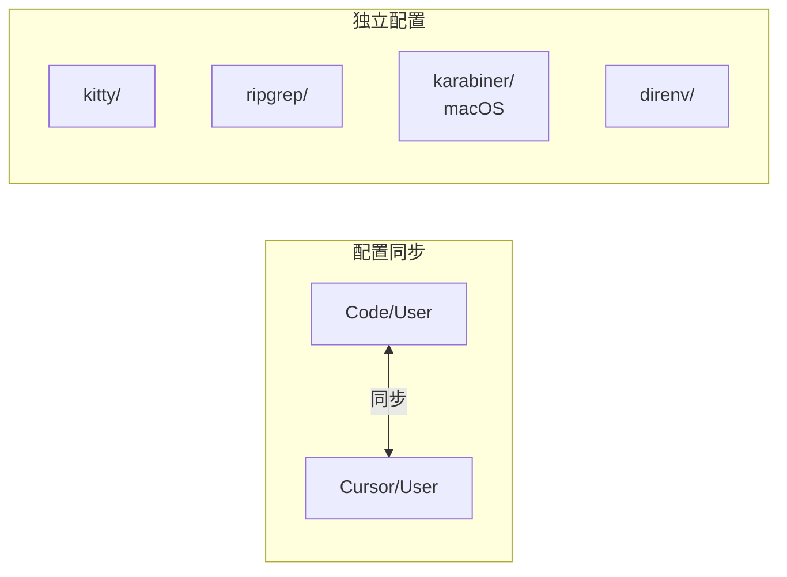

# Dotfiles

跨平台（macOS / Linux）开发环境一键部署系统。一条命令完成 Shell、编辑器、终端、Git、SSH、包管理、AI 工具链的全套配置。

---

## 快速开始

```bash
# 完整安装（macOS: Homebrew + 配置 / Linux: Pixi + 配置）
curl -fsSL https://raw.githubusercontent.com/Learner-Geek-Perfectionist/Dotfiles/beta/install.sh | bash

# 浅克隆到本地（仅最新提交，节省带宽）
git clone --depth=1 -b beta https://github.com/Learner-Geek-Perfectionist/Dotfiles.git

# 选择性安装
bash install.sh --dotfiles-only   # 仅配置文件
bash install.sh --pixi-only       # 仅 Pixi 包管理器（Linux）
bash install.sh --vscode-only     # 仅 VSCode/Cursor 插件
bash install.sh --lsp-only        # 仅 LSP 服务器
bash install.sh --skip-vscode     # 跳过 VSCode 插件
```

## 功能概览

### Shell（Zsh）

- **[Zinit](https://github.com/zdharma-continuum/zinit)** 插件管理器，Turbo 异步加载
- **[Powerlevel10k](https://github.com/romkatv/powerlevel10k)** 主题，instant prompt 缓存加速
- **[fzf-tab](https://github.com/Aloxaf/fzf-tab)** 模糊补全、**[fast-syntax-highlighting](https://github.com/zdharma-continuum/fast-syntax-highlighting)** 语法高亮、**[zsh-autosuggestions](https://github.com/zsh-users/zsh-autosuggestions)** 自动建议
- 智能命令包装：`fd` 自动提权、`cat` → `bat`、`ls` → `eza`、`man` → `tldr`
- `.zwc` 字节码预编译加速启动
- **[age](https://github.com/FiloSottile/age)** 加密令牌管理

### 包管理

| 平台 | 管理器 | 配置文件 |
|------|--------|----------|
| macOS | Homebrew | `lib/packages.sh`（80+ formulas & casks） |
| Linux | Pixi（无需 root，conda-forge） | `pixi.toml`（90+ 包） |

### 终端 & 编辑器

- **[Kitty](https://sw.kovidgoyal.net/kitty/)** 终端，Catppuccin Frappe 主题，智能标签页/关闭脚本
- **VSCode / Cursor** 配置同步（settings.json + keybindings.json），插件自动安装
- **Neovim / Vim**

### macOS 专属

- **[Karabiner-Elements](https://karabiner-elements.pqrs.org/)** 键盘改键
- **[Hammerspoon](https://www.hammerspoon.org/)** 窗口管理与自动化
- Homebrew 自动维护（每小时顺序执行 `brew update` / `brew upgrade --greedy` / `brew cleanup --prune=all`）

### AI 工具链

- **Claude Code** CLI + LSP 服务器（pyright, gopls, rust-analyzer, clangd, kotlin-ls 等）
- **Codex CLI** 配置同步（model / sandbox / features / status line）
- MCP 服务器集成、插件市场、Skill 系统

### 开发工具链

语言：Python, Node.js, Go, Rust, Kotlin, Java, Ruby, Lua, C/C++（LLVM/GCC）

构建：CMake, Ninja, Make, Autoconf

## 快捷键 & 常用操作

### 键盘改键（Karabiner-Elements）

底层键位重映射，所有上层快捷键依赖此配置：

| 物理键 | 映射为 | 说明 |
|--------|--------|------|
| 右 Command | Ctrl + Alt + Cmd | **HyperKey** — Hammerspoon 所有快捷键的修饰键 |
| 右 Option | Ctrl + Alt + Cmd | 同上，左右手均可触发 HyperKey |
| CapsLock | 左 Shift | 废键利用，更符合人体工学 |

### 输入法切换（Shift / Caps）

- `left_shift`、`right_shift`、`caps_lock` 单击切换中英文，长按只保留普通 `Shift` 语义。
- `caps_lock` 在这套配置里等同于 `left_shift`，不再提供大写锁定。
- 如果机器安装了微信输入法，则它是唯一主 provider：单击 `Shift` / `Caps` 只服务微信输入法内部中英切换。
- 微信输入法前提：在微信输入法设置里开启“单击 `Shift` 切换中英文”。
- 如果机器没有微信输入法，但安装了 macOS 自带英文和中文输入法，则单击 `Shift` / `Caps` 会发送 `Control-Space`。
- Apple 输入法前提：macOS 系统设置中的输入法切换快捷键必须配置为 `Control-Space`。
- 混装机器上如果你手动切到 Apple 输入法，这组键不会帮你切 Apple 中英文；这是为了保持热路径最短而做的明确边界。

### 应用切换（Hammerspoon · HyperKey + 字母）

HyperKey 即 `Ctrl + Alt + Cmd`（通过右 Command 或右 Option 一键触发）：

| 快捷键 | 应用 | 快捷键 | 应用 |
|--------|------|--------|------|
| Hyper + T | Kitty 终端 | Hyper + V | VS Code |
| Hyper + S | Safari | Hyper + G | ChatGPT |
| Hyper + C | Claude Desktop | Hyper + F | Finder |
| Hyper + W | 微信 | Hyper + Q | QQ |
| Hyper + D | Discord | Hyper + M | Mihomo Party |
| Hyper + I | IntelliJ IDEA | Hyper + A | Android Studio |
| Hyper + P | PyCharm | Hyper + U | 剪贴板工具 |
| Hyper + O | OrbStack | Hyper + . | 活动监视器 |

行为逻辑：应用在前台 → 隐藏；在后台 → 激活；未运行 → 启动。

### 窗口管理（Hammerspoon · HyperKey + 方向键）

| 快捷键 | 效果 |
|--------|------|
| Hyper + ← | 窗口占屏幕左半 |
| Hyper + → | 窗口占屏幕右半 |
| Hyper + ↑ | 窗口最大化 |
| Hyper + ↓ | 窗口居中（80%） |
| Hyper + `` ` `` | 同一应用的多窗口间循环切换 |

### 系统功能（Hammerspoon）

| 快捷键 | 功能 |
|--------|------|
| Hyper + L | 锁屏 |
| Hyper + 1 | 切换 Caffeinate 模式（阻止息屏） |

菜单栏实时显示：CPU / 内存 / 磁盘 / 网速 / 负载 / Wi-Fi / 电池（点击可复制信息）。

### 终端快捷键（Kitty）

#### 标签页 & 窗口

| 快捷键 | 操作 |
|--------|------|
| Cmd + E | **智能新标签页**（继承当前上下文；SSH 中 2 秒内尝试复用远端主机与目录，失败回退本地 shell） |
| Cmd + W | **智能关闭**（多窗口关窗口，单窗口关标签页） |
| Cmd + N | **智能新窗口**（继承当前上下文；SSH 中 2 秒内尝试复用远端主机与目录，失败回退本地 shell） |
| Cmd + Enter | 水平分屏 |
| Cmd + D | 垂直分屏 |
| Cmd + Shift + D | 水平分屏 |
| Cmd + 1–9, 0 | 跳转到第 1–10 个标签页 |
| Cmd + Option + ←/→ | 移动标签页顺序 |

#### 导航 & 显示

| 快捷键 | 操作 |
|--------|------|
| Cmd + ←/→ | 光标跳到行首 / 行尾 |
| Cmd + ↑/↓ | 滚动到顶部 / 底部 |
| Cmd + [ / ] | 切换上一个 / 下一个窗格 |
| Cmd + L | 切换布局模式 |
| Cmd + =/- | 字体放大 / 缩小 |
| Cmd + , | 编辑 kitty.conf |

#### 鼠标操作

选中即复制 · 双击选词 · 三击选行 · Ctrl+Option+拖选 矩形选区

### Shell 快捷键 & 别名（Zsh）

#### 键盘快捷键

| 快捷键 | 功能 |
|--------|------|
| ESC ESC（双击） | 清空当前输入行 |
| ↑ / ↓ | 按已输入前缀搜索历史命令 |
| Ctrl + T | fzf 模糊搜索文件 |
| Ctrl + R | fzf 模糊搜索历史命令 |
| Alt + C | fzf 模糊跳转目录 |
| Tab | fzf-tab 模糊补全（`<` / `>` 切换分组） |

#### 常用别名

| 别名 | 实际命令 | 说明 |
|------|----------|------|
| `cat` | `bat`（自动判断） | 纯文件用 bat 高亮，管道/ANSI 回退原生 cat |
| `ls` | `eza --color=always --icons -ha` | 带图标、隐藏文件、ISO 时间 |
| `ll` | `eza --color=always --icons -ha --long` | 长格式列表 |
| `man` | `tldr` | 简化版手册 |
| `fd` | 自动 sudo fd | 有免密 sudo 时自动提权 |
| `python` | `python3` | — |
| `g1` | `git clone --depth=1 --recursive` | 浅克隆 |
| `mkdir` | `mkdir -p` | 自动创建父目录 |
| `cp` | `cp -r` | 默认递归 |
| `show` | `kitty +kitten icat` | 终端内显示图片 |
| `ssh` | `kitten ssh`（Kitty 内） | 自动传输 terminfo |
| `rg` | rg + 自定义忽略规则 | 使用 `.config/ripgrep/ignore` |
| `reload` | 重新加载所有 zsh 配置 | — |
| `upgrade` | 远程拉取最新配置并重载 | — |
| `edit-tokens` | age 加密令牌管理 | 编辑后自动加密保存 |

## 架构

### 安装模块


```mermaid
graph TD
    A["install.sh<br/>统一入口 v5.0"] --> B["macos_install<br/>Homebrew 80+ 包"]
    A --> C["install_dotfiles<br/>配置文件符号链接"]
    A --> D["install_vscode<br/>VSCode/Cursor 插件"]
    A --> E["install_claude_code<br/>LSP / MCP / Skills"]
    A --> F["install_kotlin<br/>Kotlin Native 工具链"]
    B -. "Linux 替代" .-> G["install_pixi<br/>Pixi (rootless)"]
```

### Shell 加载顺序


```mermaid
graph LR
    A[".zshenv<br/>环境变量"] --> B[".zprofile<br/>Homebrew shellenv"]
    B --> C[".zshrc<br/>交互式入口"]
    C --> D["platform.zsh<br/>平台 PATH & 别名"]
    C --> E["zinit.zsh<br/>插件管理 & Turbo"]
    C --> F["double-esc-clear<br/>双击 ESC 清屏"]
    C --> G["age-tokens.zsh<br/>加密凭证"]
```

### 应用配置（.config/）


```mermaid
graph LR
    subgraph sync ["配置同步"]
        A["Code/User"] <-- "同步" --> B["Cursor/User"]
    end
    subgraph standalone ["独立配置"]
        C["kitty/"]
        D["ripgrep/"]
        E["karabiner/<br/>macOS"]
        F["direnv/"]
    end
```

## 设计原则

- **模块化** — 每个组件独立安装/卸载
- **幂等** — 重复执行安全无副作用
- **对称** — 每个 install 都有对应的 uninstall
- **无需 root** — Linux 全程 rootless（Pixi + conda-forge）
- **管道安全** — 支持 `curl | bash` 远程执行

## 卸载

```bash
bash uninstall.sh --all            # 全部卸载
bash uninstall.sh --dotfiles       # 仅配置文件
bash uninstall.sh --pixi           # 仅 Pixi
bash uninstall.sh --claude         # 仅 Claude Code
```

## 许可证

MIT
