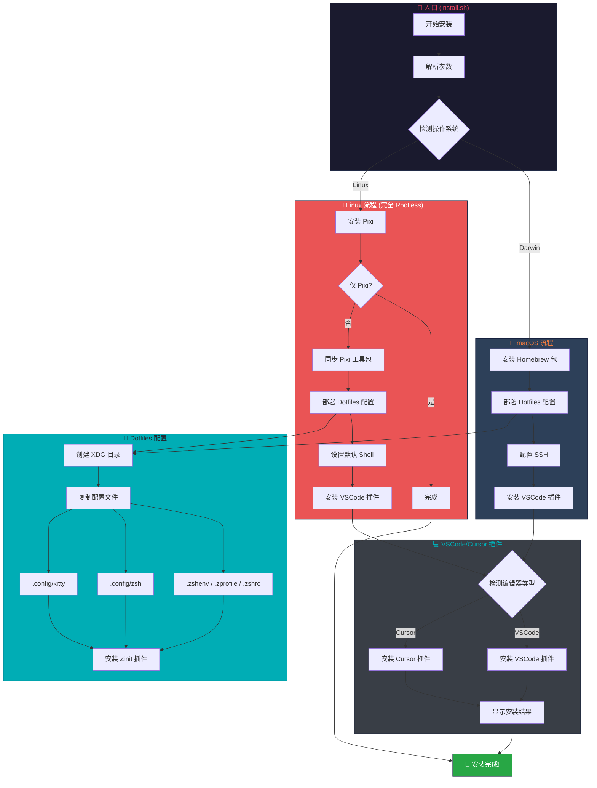
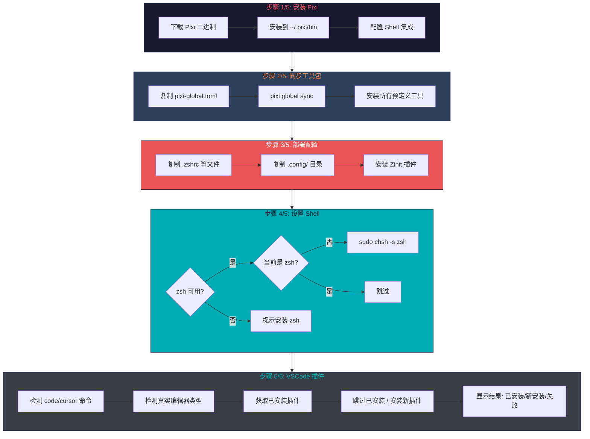
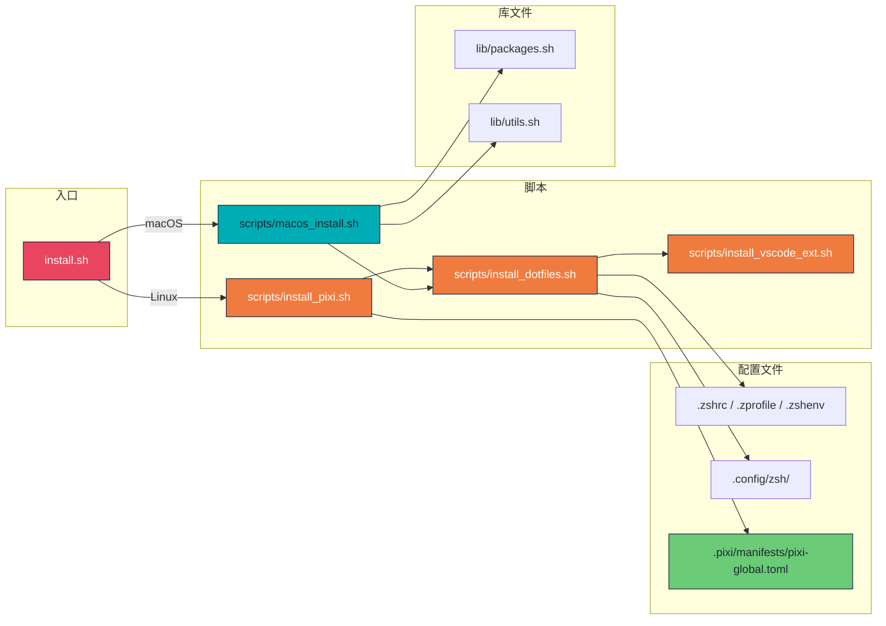
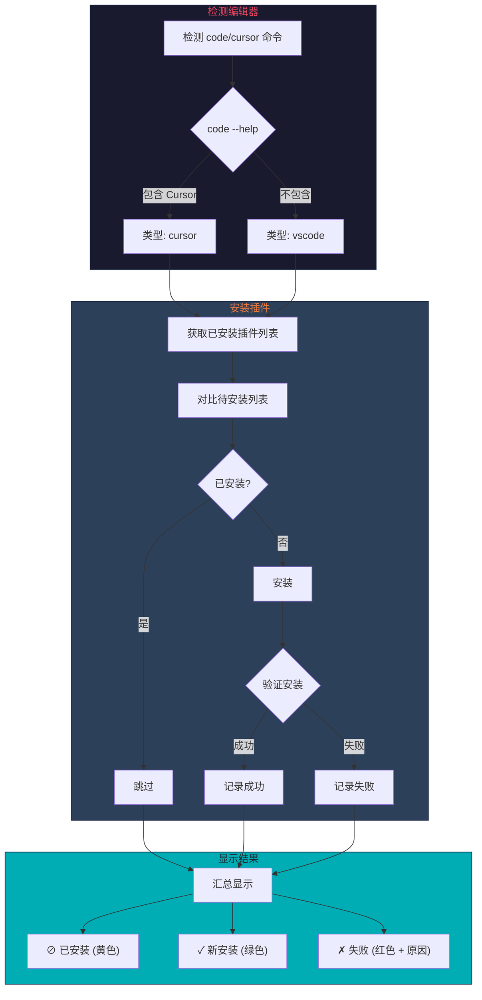
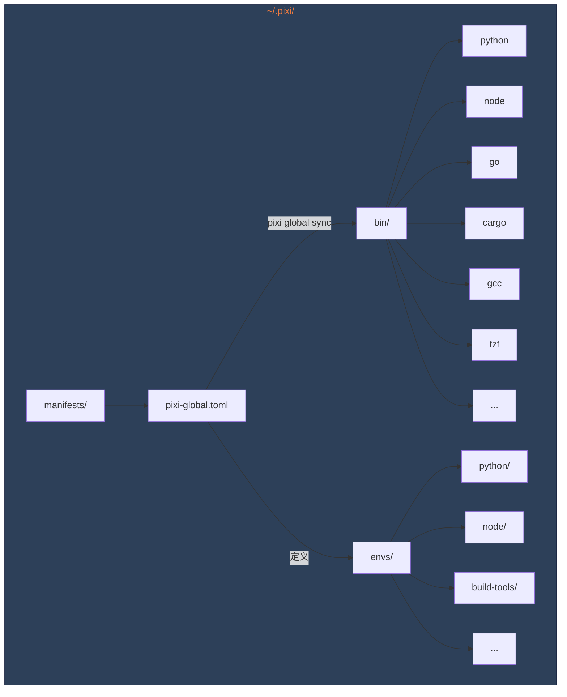

# Dotfiles 项目执行流程图

## 整体安装流程

## Linux 安装详细流程

## 文件调用关系

## VSCode/Cursor 插件安装流程

## Pixi 工具包结构

## 架构优势

| 特性 | 说明 |
|------|------|
| **完全 Rootless** | Linux 上所有工具安装在 `~/.pixi/`，无需 root |
| **预编译二进制** | 从 conda-forge 下载预编译包，秒装即用 |
| **智能检测** | 自动检测 VSCode/Cursor，安装对应插件 |
| **跳过已安装** | 检测已安装的插件，只安装缺失的 |
| **验证安装** | 安装后验证是否真正成功，避免假阳性 |
| **彩色输出** | 清晰的颜色区分：成功/跳过/失败 |
