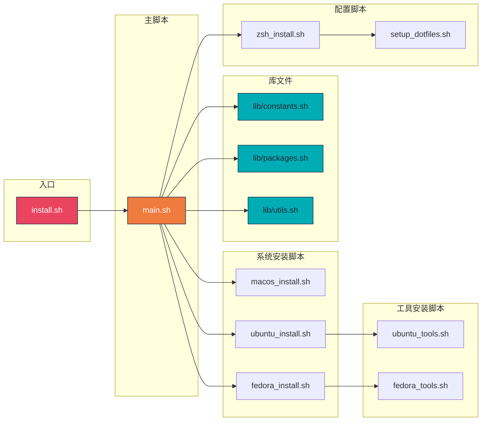
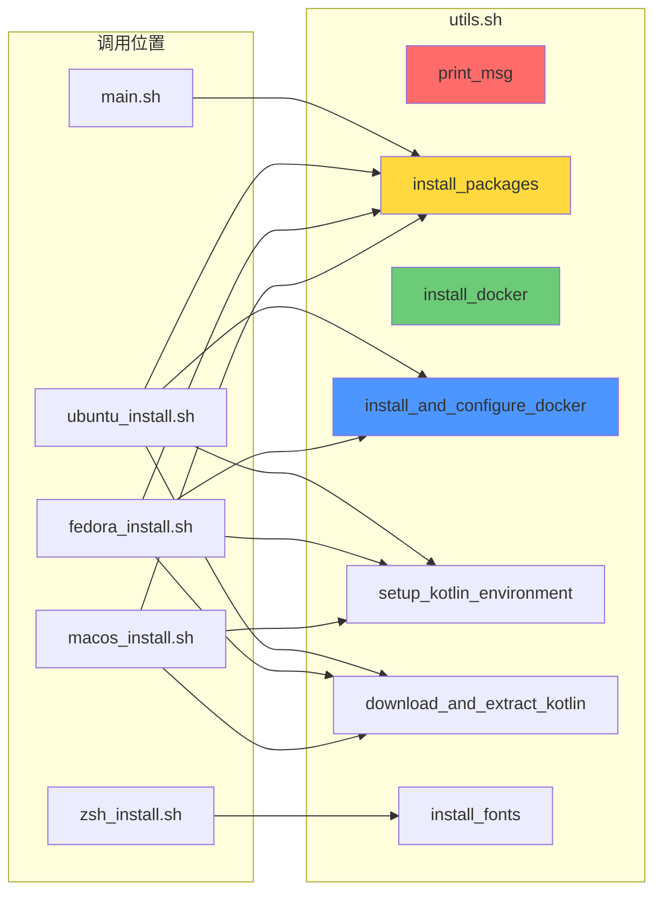

# Dotfiles 项目执行流程图

```mermaid
flowchart TB
    subgraph Entry["🚀 入口 (install.sh)"]
        A[开始安装] --> B[初始化日志文件]
        B --> C{检测操作系统}
        C -->|Linux| D[安装基础依赖<br/>git/curl/wget等]
        C -->|macOS| E[检查 Xcode CLI]
        D --> F[配置免密 sudo]
        E --> F
        F --> G[克隆 Dotfiles 仓库<br/>到 /tmp/Dotfiles]
        G --> H[创建 XDG 目录结构]
        H --> I[执行 main.sh]
    end

    subgraph Main["📋 主脚本 (main.sh)"]
        I --> J[加载库文件<br/>constants/packages/utils]
        J --> K{检测操作系统类型}
    end

    subgraph macOS["🍎 macOS 安装流程"]
        K -->|Darwin| L1[检查 Xcode CLI Tools]
        L1 --> L2[安装/检查 Homebrew]
        L2 --> L3[安装 CLI 工具<br/>brew formulas]
        L3 --> L4[安装 GUI 应用<br/>brew casks]
        L4 --> L5[配置网络工具权限<br/>添加用户到 access_bpf 组]
        L5 --> L6[安装 Kotlin Native<br/>Compiler 已由 brew 安装]
    end

    subgraph Ubuntu["🐧 Ubuntu 安装流程"]
        K -->|Ubuntu| U1[配置 USTC 镜像源]
        U1 --> U2[配置时区/区域<br/>Asia/Shanghai]
        U2 --> U3[添加 PPA 源<br/>Wireshark等]
        U3 --> U4[安装核心包<br/>packages_ubuntu]
        U4 --> U5[执行 ubuntu_tools.sh]

        subgraph UTools["🔧 Ubuntu Tools"]
            U5 --> UT1[安装 cmake]
            UT1 --> UT2[安装 LLVM 套装]
            UT2 --> UT3[安装 fastfetch]
            UT3 --> UT4[安装 kitty]
            UT4 --> UT5[安装 fzf]
        end

        UT5 --> U6[执行 Unminimize]
        U6 --> U7[安装 OpenJDK]
        U7 --> U8[安装 Docker]
        U8 --> U9[安装 Kotlin<br/>Native + Compiler]
    end

    subgraph Fedora["🎩 Fedora 安装流程"]
        K -->|Fedora| F1[配置 USTC 镜像源]
        F1 --> F2[配置时区/区域]
        F2 --> F3[启用 Man Pages]
        F3 --> F4[安装开发工具组]
        F4 --> F5[安装核心包<br/>packages_fedora]
        F5 --> F6[执行 fedora_tools.sh]
        F6 --> F7[重装缺失 man 的包]
        F7 --> F8[安装 Docker]
        F8 --> F9[安装 Kotlin<br/>Native + Compiler]
    end

    subgraph Linux["🐧 Linux 通用步骤"]
        L6 --> X1
        U9 --> X1[设置网络工具权限<br/>tcpdump/wireshark]
        F9 --> X1
        X1 --> X2[切换默认 Shell 为 zsh]
    end

    subgraph ZSH["🐚 ZSH 配置 (zsh_install.sh)"]
        X2 --> Z1
        L6 -->|macOS 直接| Z1[安装字体<br/>可选/交互式]
        Z1 --> Z2[执行 setup_dotfiles.sh]
    end

    subgraph Dotfiles["📁 Dotfiles 配置"]
        Z2 --> D1[复制配置文件]
        D1 --> D2[".zshenv / .zprofile / .zshrc"]
        D1 --> D3[".config/kitty"]
        D1 --> D4[".config/zsh"]
        D2 & D3 & D4 --> D5{macOS?}
        D5 -->|是| D6[复制 sh-script]
        D6 --> D7[配置 Hammerspoon]
        D7 --> D8[配置 Karabiner]
        D8 --> D9
        D5 -->|否| D9[执行 zinit-plugin.zsh]
        D9 --> D10[清理 zcompdump]
    end

    D10 --> END[🎉 安装完成!]

    style Entry fill:#1a1a2e,stroke:#16213e,color:#e94560
    style Main fill:#0f3460,stroke:#16213e,color:#e94560
    style macOS fill:#2d4059,stroke:#16213e,color:#f07b3f
    style Ubuntu fill:#ea5455,stroke:#16213e,color:#fff
    style Fedora fill:#2d4059,stroke:#16213e,color:#f07b3f
    style Linux fill:#222831,stroke:#16213e,color:#00adb5
    style ZSH fill:#393e46,stroke:#16213e,color:#00adb5
    style Dotfiles fill:#00adb5,stroke:#16213e,color:#222831
    style UTools fill:#ff6b6b,stroke:#16213e,color:#fff
    style END fill:#28a745,stroke:#16213e,color:#fff
```

## 文件调用关系

```mermaid
graph LR
    subgraph 入口
        A[install.sh]
    end

    subgraph 主脚本
        B[main.sh]
    end

    subgraph 库文件
        C1[lib/constants.sh]
        C2[lib/packages.sh]
        C3[lib/utils.sh]
    end

    subgraph 系统安装脚本
        D1[macos_install.sh]
        D2[ubuntu_install.sh]
        D3[fedora_install.sh]
    end

    subgraph 工具安装脚本
        E1[ubuntu_tools.sh]
        E2[fedora_tools.sh]
    end

    subgraph 配置脚本
        F1[zsh_install.sh]
        F2[setup_dotfiles.sh]
    end

    A --> B
    B --> C1 & C2 & C3
    B --> D1 & D2 & D3
    D2 --> E1
    D3 --> E2
    B --> F1
    F1 --> F2

    style A fill:#e94560,stroke:#16213e,color:#fff
    style B fill:#f07b3f,stroke:#16213e,color:#fff
    style C1 fill:#00adb5,stroke:#16213e,color:#222831
    style C2 fill:#00adb5,stroke:#16213e,color:#222831
    style C3 fill:#00adb5,stroke:#16213e,color:#222831
```

## 关键函数调用

```mermaid
flowchart LR
    subgraph utils.sh
        U1[print_msg]
        U2[install_packages]
        U3[install_docker]
        U4[install_and_configure_docker]
        U5[setup_kotlin_environment]
        U6[download_and_extract_kotlin]
        U7[install_fonts]
    end

    subgraph 调用位置
        M1[main.sh] --> U2
        M2[ubuntu_install.sh] --> U2 & U4 & U5 & U6
        M3[fedora_install.sh] --> U2 & U4 & U5 & U6
        M4[macos_install.sh] --> U2 & U5 & U6
        M5[zsh_install.sh] --> U7
    end

    style U1 fill:#ff6b6b
    style U2 fill:#ffd93d
    style U3 fill:#6bcb77
    style U4 fill:#4d96ff
```

