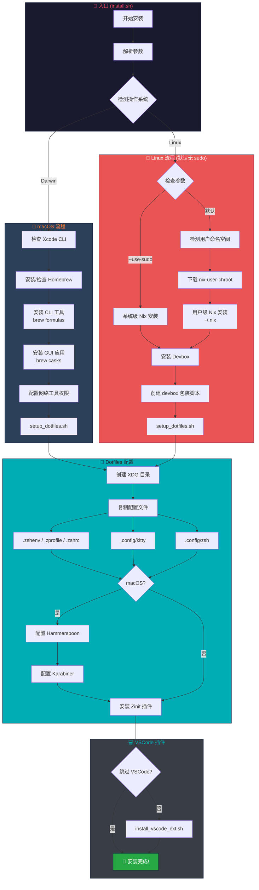
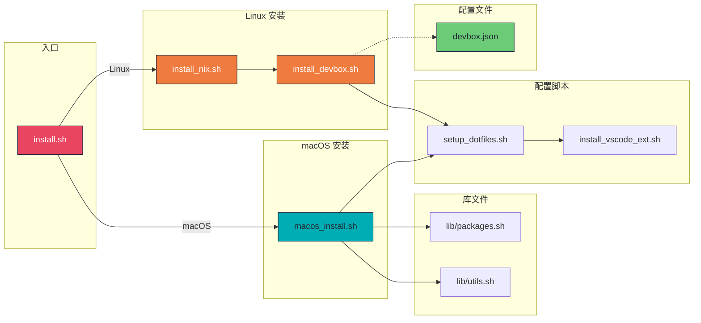
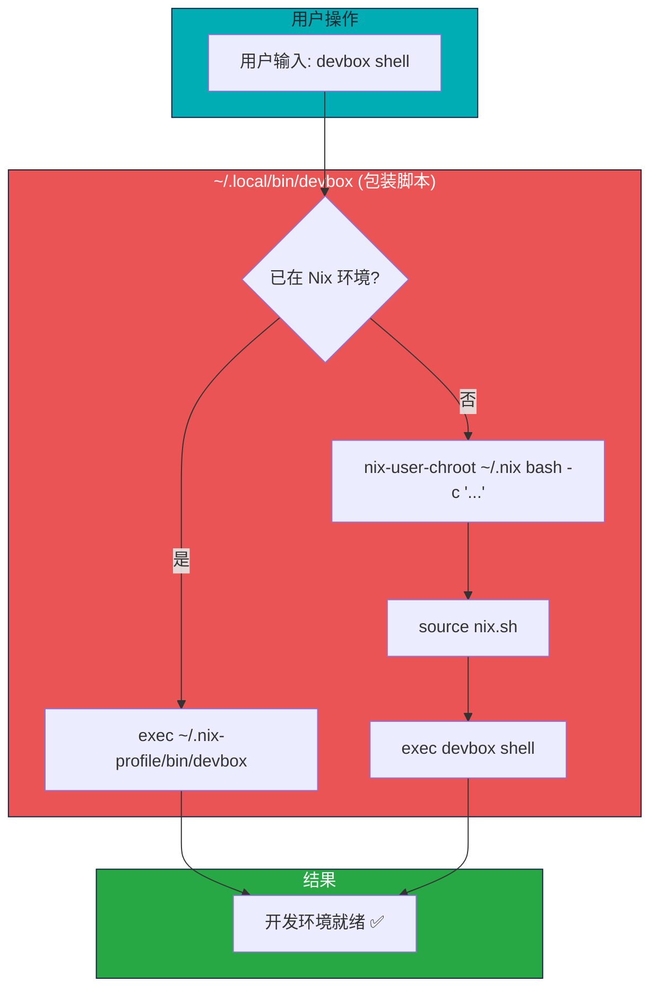
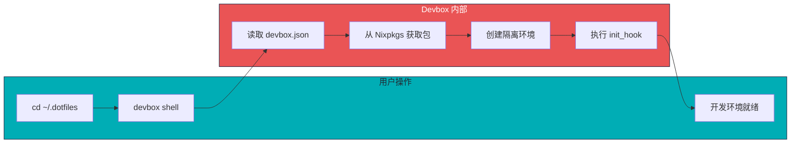

# Dotfiles 项目执行流程图

## 整体安装流程



## 文件调用关系



## Nix-User-Chroot 安装流程

```mermaid
flowchart TB
    subgraph Check["检测环境"]
        A[开始] --> B{支持用户命名空间?}
        B -->|否| C[❌ 无法安装]
        B -->|是| D[创建 ~/.nix 目录]
    end

    subgraph Download["下载工具"]
        D --> E{检测架构}
        E -->|x86_64| F1[下载 x86_64 版本]
        E -->|aarch64| F2[下载 aarch64 版本]
        F1 & F2 --> G[nix-user-chroot]
    end

    subgraph Install["安装 Nix"]
        G --> H[nix-user-chroot ~/.nix bash]
        H --> I[curl nixos.org/install | sh]
        I --> J[Nix 安装到 ~/.nix]
    end

    subgraph Wrapper["创建包装脚本"]
        J --> K[~/.local/bin/nix-enter]
        K --> L[~/.local/bin/nix-shell-wrapper]
    end

    L --> M[✅ 完成]

    style Check fill:#1a1a2e,stroke:#16213e,color:#e94560
    style Download fill:#2d4059,stroke:#16213e,color:#f07b3f
    style Install fill:#ea5455,stroke:#16213e,color:#fff
    style Wrapper fill:#00adb5,stroke:#16213e,color:#222831
```

## Devbox 包装脚本工作流程



> 💡 用户无需先运行 `nix-enter`，包装脚本会自动检测环境并透明处理 nix-user-chroot。

## Devbox 内部工作流程



## 架构优势

| 特性 | 说明 |
|------|------|
| **统一包管理** | 使用 devbox.json 定义包，无需为不同发行版维护脚本 |
| **无需 sudo** | 默认使用 nix-user-chroot 实现用户级安装 |
| **透明包装** | devbox 包装脚本自动处理 nix 环境，用户无感知 |
| **包版本锁定** | Nix 保证包版本一致，可复现 |
| **维护成本低** | 一份配置适用于所有 Linux 发行版 |
